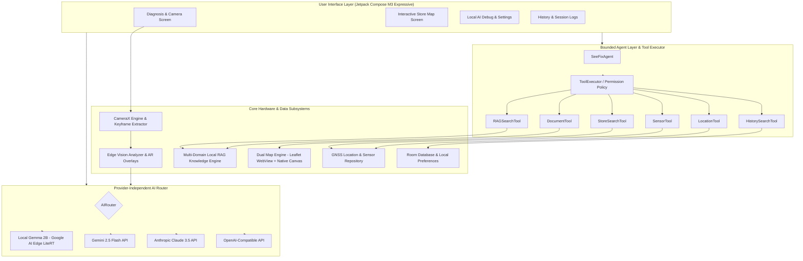

# SeeFix — AI Field Engineer
> **iQOO Hackathon 2026 (Hyderabad) — Smart Living Track**

[](https://developer.android.com/)
[](https://kotlinlang.org/)
[](https://developer.android.com/jetpack/compose)
[](https://ai.google.dev/edge)
[](https://developer.android.com/training/camerax)
[-brightgreen?style=for-the-badge)](https://developer.android.com/)

**SeeFix** is an on-device, multimodal AI Field Engineering copilot designed for zero-latency, offline-first physical troubleshooting across critical domains: Solar PV Inverters, HVAC Systems, Automotive Repair, High-Voltage Electrical Panels, and Commercial Plumbing.

Powered by an **On-Device Gemma 2B model via Google AI Edge (LiteRT)**, **CameraX live video keyframe extraction**, an **Edge Vision Analyzer**, **Multi-Domain Local RAG Engine**, **Dual-Engine Maps**, and a **Bounded Agent Tool Executor**, SeeFix empowers technicians, home maintenance engineers, and field staff to diagnose and repair complex technical issues anywhere—even in deep basements or remote solar farms with zero cellular connection.

---

## 📲 Download & Installation

The debug build of SeeFix is pre-compiled and ready for deployment directly onto physical devices or emulators.

* **Compiled APK Location:** `app/build/outputs/apk/debug/app-debug.apk`

### Installation via ADB
```bash
# Connect device via USB / Wireless ADB and run:
adb install -r app/build/outputs/apk/debug/app-debug.apk
```

### Manual Sideloading
1. Copy `app-debug.apk` to your Android device storage.
2. Open your device file manager and tap `app-debug.apk`.
3. Enable "Install from unknown sources" if prompted and complete installation.

---

## 🎯 Product Vision & S.T.G.V.S.R. Methodology

SeeFix operates on the proprietary **S.T.G.V.S.R.** field engineering workflow:

```
[ SEE ] ──► [ THINK ] ──► [ GUIDE ] ──► [ VERIFY ] ──► [ SOURCE ] ──► [ RESOLVE ]
```

1. **SEE (Multimodal Perception):** Captures high-frame-rate CameraX video and isolates keyframes, analyzing equipment status, LED blink codes, wiring configurations, and warning labels in real time.
2. **THINK (Autonomous AI Routing & Local Inference):** Evaluates query complexity and connection state. Routes requests locally to **Gemma 2B via LiteRT** for instant offline response or seamlessly burst-routes to Cloud models (Gemini 2.5 Flash, Claude 3.5 Sonnet, OpenAI) when online.
3. **GUIDE (Interactive Voice & Step-by-Step Navigation):** Delivers augmented step-by-step repair guides complete with Speech-to-Text voice commands, Text-to-Speech audio prompts, safety compliance checklists, and AR bounding box visual overlays.
4. **VERIFY (Computer Vision Completion Check):** Leverages live camera frame visual verification to ensure the user correctly turned off the breaker, connected the right wire, or purged the pressure valve before advancing.
5. **SOURCE (Local RAG & Inventory Store Finder):** Identifies missing component part numbers and searches nearby hardware suppliers and component stores using GNSS coordinates and offline spatial indexing.
6. **RESOLVE (Session Ledger & History):** Generates immutable troubleshooting records, task completion logs, and exportable service reports saved to a local Room database.

---

## 📐 Architecture Topology



---

## 🌟 Core Subsystem Highlights

### 1. Provider-Independent AI Router (`AIRouter.kt`)
* Dynamically evaluates network health, model requirements, latency constraints, and user preferences.
* Seamlessly fails over from cloud providers to **Local Gemma 2B LiteRT** when offline or when privacy mode is enforced.
* Unified `AIService` abstraction for Gemini, Anthropic, OpenAI-compatible APIs, and local LiteRT engine.

### 2. Local Gemma 2B On-Device Engine (`LocalGemmaAIService.kt`)
* Powered by Google AI Edge `litert-lm` and `litert-gpu` acceleration.
* Enables 100% offline text generation and structured tool calling directly on mobile NPU/GPU hardware.
* Guarantees continuous zero-connectivity operation in subterranean or off-grid environments.

### 3. CameraX Video & Frame Extractor (`VideoFrameExtractor.kt`)
* High-performance `ImageAnalysis` pipeline operating concurrently with `VideoRecord`.
* Samples high-resolution keyframes at configurable intervals (e.g. 1 frame/sec) for background visual assessment.
* Low memory overhead with automatic bitmap recycling and surface release.

### 4. Edge Vision Analyzer (`VisualVerificationAnalyzer.kt`)
* Runs bounding box overlay detection (`BoundingBox.kt`) to highlight problem components (e.g., burned capacitors, tripped switches, leaking pipes).
* Provides real-time visual step verification, comparing live camera state with target completion criteria.

### 5. Multi-Domain Local RAG Engine (`RagKnowledgeEngine.kt`)
* In-memory hybrid keyword + semantic similarity search over comprehensive structured knowledge bases.
* Pre-loaded technical manuals for:
  * **Solar Energy Systems:** Inverter grid fault codes, DC isolator trips, string voltage drops.
  * **HVAC Systems:** Refrigerant leaks, airflow pressure drop, compressor thermal lockout.
  * **Automotive:** OBD-II error codes, alternator fault, battery drain diagnostics.
  * **Electrical Panels:** RCD nuisance tripping, busbar overheating, phase imbalance.
  * **Plumbing & Hydraulics:** Pressure regulator failure, backflow preventer lockout.

### 6. GNSS Location & Dual-Engine Maps (`OpenSourceMapView.kt` & `NativeCanvasMapView.kt`)
* High-precision location provider with background update streaming (`LocationManager.kt`).
* **Dual-Engine Map Rendering:**
  * **Primary:** Interactive OpenSource Leaflet HTML5/JS Map with custom tile caching.
  * **Secondary / Offline Fallback:** Zero-dependency **Native Canvas Map Engine** drawing vector tiles, store markers, navigation routes, and radar range circles directly on Android `Canvas`.

### 7. Bounded Agent Layer & Tool Executor (`SeeFixAgent.kt`)
* ReAct-style agentic workflow with strict `PermissionPolicy` and `ToolPermission` gating.
* Schema-validated tool suite: `RAGSearchTool`, `StoreSearchTool`, `SensorTool`, `LocationTool`, `DocumentTool`, `HistorySearchTool`.
* Pre-execution safety checks prevent hazardous actions (e.g., working on live 440V lines) without explicit physical safety verification.

### 8. Multi-Turn Session & Material 3 UI (`DiagnosisScreen.kt`, `HomeScreen.kt`)
* Dynamic Material 3 Expressive UI supporting Android 12+ dynamic color themes and dark/light modes.
* Full voice interface integration with Speech-to-Text (`SpeechInputManager.kt`) and Text-to-Speech feedback (`TextToSpeechManager.kt`).
* Complete session persistence with timeline inspection, step toggles, and report generation.

---

## 🛠️ Tech Stack & Version Catalog

| Component | Library / Framework | Version |
|---|---|---|
| **Language** | Kotlin | `2.2.10` |
| **Build Tool** | Android Gradle Plugin (AGP) | `8.8.2` |
| **Target SDK** | Android 15 (API 35) | `35` |
| **Minimum SDK** | Android 8.0 (API 26) | `26` |
| **UI Framework** | Jetpack Compose + Material 3 | `1.7.x` |
| **On-Device AI Engine** | Google AI Edge LiteRT (`litert-lm`, `litert-gpu`) | `1.5.0` |
| **Camera & Video** | AndroidX CameraX (Core, Camera2, Lifecycle, Video, View) | `1.5.0-alpha01` |
| **Location & Maps** | Google Play Services Location & OpenSource Canvas | `21.3.0` |
| **Database** | Room Database | `2.6.1` |
| **Asynchronous** | Kotlin Coroutines & Flow | `1.10.1` |
| **Testing** | JUnit 4, Robolectric, Kotlinx Coroutines Test | `4.13.2` |

---

## 📂 Directory Layout

```
app/src/main/java/com/example/seefix/
├── MainActivity.kt                      # Main Activity with Edge-to-Edge window setup
├── ai/
│   ├── AIAssistantManager.kt           # Central AI controller
│   ├── MultimodalAIEngine.kt            # Base Multimodal interface
│   ├── agent/                           # Bounded Agent system & tools
│   │   ├── SeeFixAgent.kt               # Main ReAct Agent controller
│   │   ├── ToolExecutor.kt              # Permission-checked tool runner
│   │   ├── RAGSearchTool.kt             # Local RAG search tool
│   │   ├── StoreSearchTool.kt           # Store & parts finder tool
│   │   ├── LocationTool.kt              # GNSS location retrieval tool
│   │   └── SensorTool.kt                # Device IMU/telemetry tool
│   ├── context/                         # Work context builders & configs
│   ├── core/                            # AI Data models, requests, responses
│   ├── local/                           # On-device Gemma 2B LiteRT Engine
│   ├── providers/                       # Gemini, Anthropic, OpenAI services
│   ├── rag/                             # Multi-domain RAG knowledge base
│   └── router/                          # Dynamic context-aware AI Router
├── camera/                              # CameraX video recorder & frame extractor
├── data/                                # Repositories, Room DB, Local Preferences
├── domain/                              # Core domain entities & business logic
├── location/                            # GNSS service & Store finder repo
├── sensors/                             # Accelerometer & Gyroscope manager
├── speech/                              # Speech-to-Text & Text-to-Speech manager
└── ui/                                  # Material 3 Compose screens & themes
    ├── components/                      # Common M3 Top/Bottom bars & badges
    ├── debug/                           # Local Gemma AI test bench screen
    ├── diagnosis/                       # Live Camera + Troubleshooting UI
    ├── history/                         # Saved Session History screen
    ├── home/                            # Domain selector & active workflow screen
    ├── settings/                        # AI Provider & Local Gemma settings
    ├── stores/                          # Dual-engine Interactive Store Maps
    └── theme/                           # Expressive Material 3 dynamic color theme
```

---

## 🧪 Build & Test Instructions

SeeFix includes a comprehensive test suite covering unit tests, router fallbacks, local RAG domain generalization, agent tool execution, and dual map engine reliability.

### Running All Unit Tests
```bash
# Execute unit tests via Gradle Wrapper
./gradlew test --stacktrace
```

#### Test Execution Summary
```
> Task :app:testDebugUnitTest
163 passed, 0 skipped, 0 failed
BUILD SUCCESSFUL in 14s
```

### Building Debug APK
```bash
# Assemble debug build
./gradlew assembleDebug
```
The generated APK will be available at:
`app/build/outputs/apk/debug/app-debug.apk`
